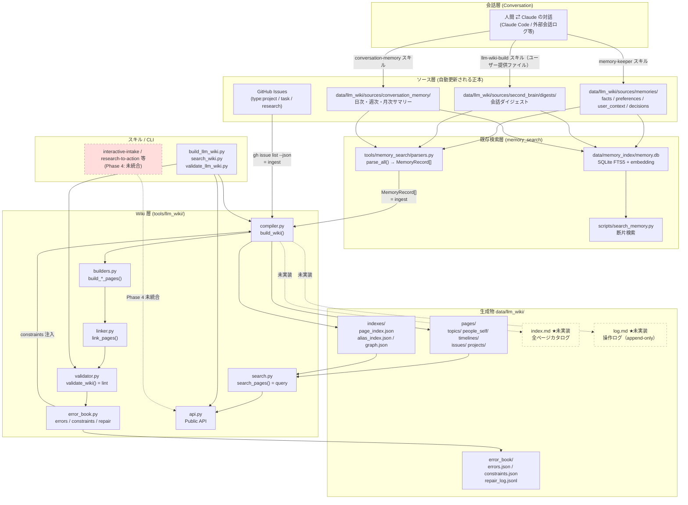
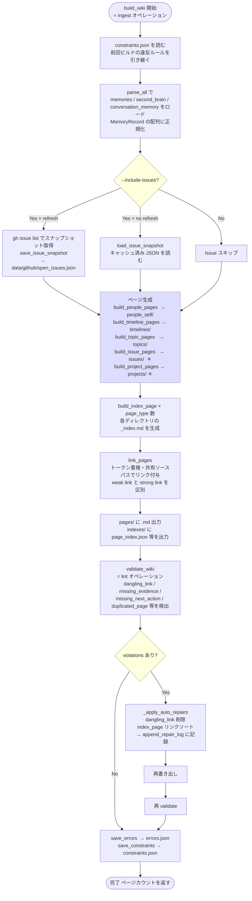
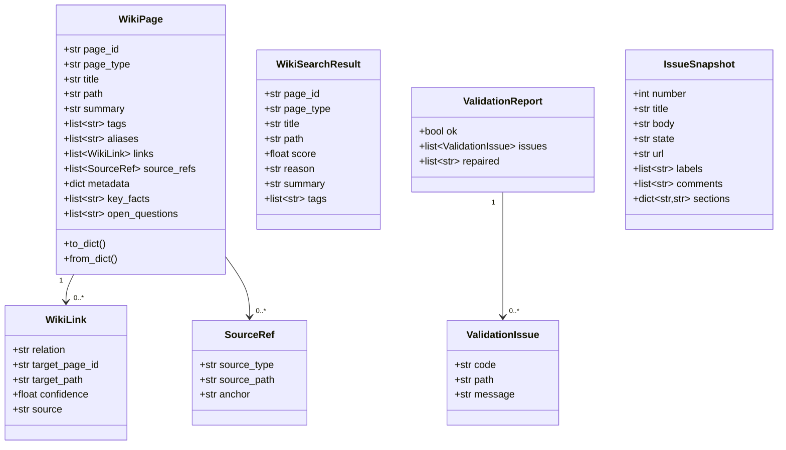
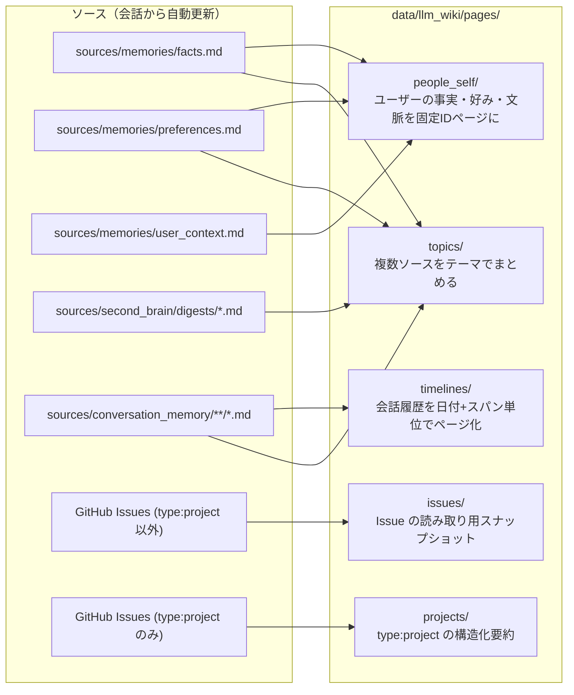
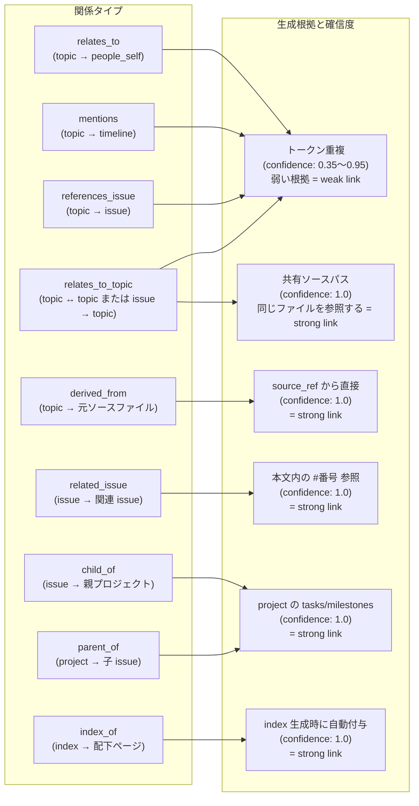
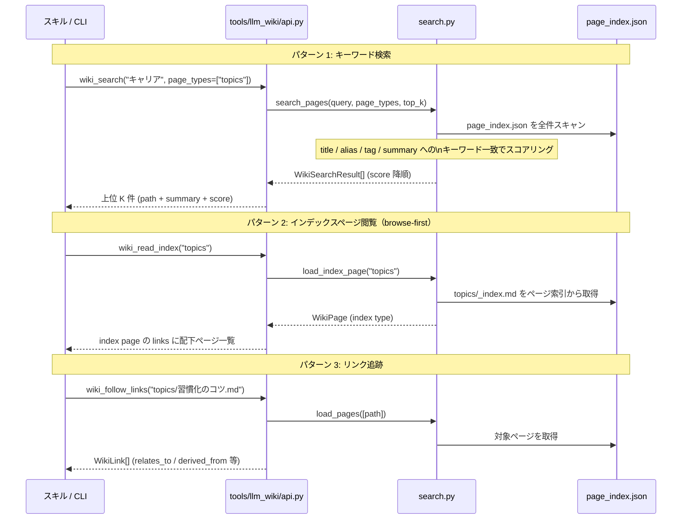
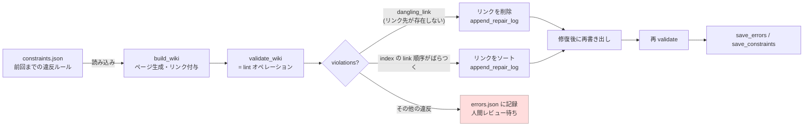

# LLMWiki — 設計・実装・運用ガイド

> **このファイルが唯一の正本。** `llm_wiki_architecture.md` と `llm_wiki_integration_spec.md` は統合済み・削除済み。
>
> LLMWiki は `data/llm_wiki/` 配下に出力される再生成可能な派生知識層。Issue への書き込みや memory の更新は既存フロー（スキル経由）のまま行う。

---

## 目次

1. [LLMWiki とは何か](#1-llmwiki-とは何か)
2. [設計原則](#2-設計原則)
3. [全体アーキテクチャ](#3-全体アーキテクチャ)
4. [ディレクトリ構成](#4-ディレクトリ構成)
5. [ビルドフロー](#5-ビルドフロー)
6. [データモデル](#6-データモデル)
7. [ページ種別とソース対応](#7-ページ種別とソース対応)
8. [リンク仕様](#8-リンク仕様)
9. [検索・探索 API](#9-検索探索-api)
10. [Error Book（lint オペレーション）](#10-error-booklint-オペレーション)
11. [GitHub Issue 接続仕様](#11-github-issue-接続仕様)
12. [使い方](#12-使い方)
13. [テスト戦略](#13-テスト戦略)
14. [リスクと対策](#14-リスクと対策)
15. [実装状況](#15-実装状況)
16. [推奨する改善項目](#16-推奨する改善項目)

---

## 1. LLMWiki とは何か

### 1.1 Karpathy パターンの原点

Andrej Karpathy が提唱した **LLM Wiki パターン** は「AI が維持する Markdown ファイルの集合体」という考え方。RAG（都度ベクトル検索）を使わず、LLM 自身がページを書き・読み・リンクを辿ることで知識を扱う。核心は以下の 3 層と 3 オペレーション。

```
raw/      ← ソース（キュレーション）
wiki/     ← LLM が書く・読むページ群
SCHEMA.md ← ページ形式・タグ分類・書き方ルールの定義
```

| オペレーション | 役割 | このリポジトリでの対応 |
|---|---|---|
| **ingest** | ソースを取り込み wiki ページを更新する | `memory-keeper` / `llm-wiki-build` / `build_llm_wiki.py` |
| **query** | wiki を検索し必要な文脈を取り出す | `wiki_search` / `wiki_read` / `wiki_follow_links` |
| **lint** | リンク切れ・矛盾・孤立ページを検出・修復する | `validate_llm_wiki.py` / Error Book |

### 1.2 このリポジトリの役割

従来の `search_memory.py` は「クエリに近い断片を返す」だけで、テーマをまたいだ推論や段階的な探索には弱かった。**LLMWiki はその弱点を補う知識整理層**として導入された。

役割の分離:
- **行動管理** → GitHub Issue（next_action・status・承認の正本）
- **長期プロフィール** → `data/llm_wiki/sources/memories/`
- **思考の記録** → `data/llm_wiki/sources/second_brain/`
- **短期会話文脈** → `data/llm_wiki/sources/conversation_memory/`
- **保存前の更新判断** → `tools/agentic_memory/`（A-MEM 風の add/update/skip/link 判定）
- **推論のための読み取り面** → `data/llm_wiki/pages/`（LLMWiki 本体）

**LLMWiki は正本ではない。`data/llm_wiki/` 配下はいつでも再生成できる派生物。**

### 1.3 ソース層の正しい理解

ソース層（`data/llm_wiki/sources/`）は**人間が手で書くものではなく、AI エージェントと人間との会話から自動的に更新される**。

```
人間 ⇄ Claude の会話
      ↓
  各スキルが自動抽出・保存
      ↓
ソース層（data/llm_wiki/sources/）← 会話の産物として自動更新
      ↓
  build_llm_wiki.py でコンパイル
      ↓
Wiki 層（data/llm_wiki/pages/）← 推論のための読み取り面
```

| ソースファイル | 更新スキル | トリガー |
|---|---|---|
| `data/llm_wiki/sources/memories/facts.md` 等 | `memory-keeper` | 会話で新しい事実・好みを観察したとき自動発動 |
| `data/llm_wiki/sources/second_brain/digests/` | `llm-wiki-build` | ユーザーが渡した会話記録やメモを取り込むとき |
| `data/llm_wiki/sources/conversation_memory/` | `conversation-memory` | 日次・週次の会話サマリー保存時 |
| `tools/agentic_memory/` | `memory-keeper` / `llm-wiki-build` / `conversation-memory` | source 書き込み前の add/update/skip/link 判定 |
| `data/llm_wiki/pages/` | `build_llm_wiki.py` | 上記の更新後に手動または定期的にビルド |

### 1.4 A-MEM との役割分担

このテンプレートでは、LLMWiki と A-MEM を競合させずに分離している。

- **A-MEM** は `sources/` 更新前段で使い、重複回避・既存記憶の更新・リンク強化・監査ログ保存を担う
- **LLMWiki** は `sources/` を `pages/` と `indexes/` にコンパイルし、検索とリンク探索を担う
- **GitHub Issue** は引き続き行動の正本であり、A-MEM から直接書き換えない

---

## 2. 設計原則

### 2.1 正本と派生物を分ける

| カテゴリ | 内容 |
|---|---|
| **正本** | GitHub Issue（タスク・意思決定・next_action）、`data/llm_wiki/sources/` 配下（メモリ・会話記録） |
| **派生物** | `data/memory_index/memory.db`（検索インデックス）、`data/llm_wiki/pages/`（wiki ページ群） |

### 2.2 LLMWiki が満たす要件

- 人間にも読める
- AI が tool-call で辿れる
- overview page から段階的に探索できる
- 元ソースへ戻れる
- リンク切れや矛盾を検出できる
- 構造修正を将来の生成に再利用できる
- 前回の失敗を次回コンパイル制約として取り込める

### 2.3 やらないこと

- GitHub Issue を廃止して Wiki を正本にすること
- 承認フローを飛ばして Issue を自動更新すること
- 常駐サーバやクラウド DB を前提にすること
- `search_memory.py` の完全置き換え（LLMWiki はその上位層として共存する）

---

## 3. 全体アーキテクチャ



---

## 4. ディレクトリ構成

```
repo-root/
│
├── data/
│   ├── github/
│   │   └── open_issues.json          # gh issue list のスナップショットキャッシュ
│   │
│   ├── memory_index/
│   │   └── memory.db                 # SQLite FTS5 + embedding（再生成可能）
│   │
│   └── llm_wiki/                     # LLMWiki 全体（再生成可能な派生物）
│       │
│       ├── sources/                  # ソース層（スキルが自動更新する正本）
│       │   ├── memories/
│       │   │   ├── facts.md          # 個人的事実
│       │   │   ├── preferences.md    # 好み・スタイル・パターン
│       │   │   ├── decisions.md      # 意思決定ログ
│       │   │   ├── user_context.md   # 役割・スタック・関心
│       │   │   └── rules.json        # if-then ルール
│       │   ├── second_brain/
│       │   │   ├── index.md          # ダイジェスト索引
│       │   │   ├── .processed        # 処理済みファイル一覧
│       │   │   ├── issue_candidates/ # digest から抽出した Issue 候補 JSON
│       │   │   └── digests/          # 外部会話ログのダイジェスト
│       │   │       └── YYYY-MM-DD_<slug>.md
│       │   └── conversation_memory/
│       │       ├── README.md
│       │       ├── daily/YYYY/       # 直近7日の会話サマリー
│       │       ├── weekly/YYYY/      # 当月の週次圧縮
│       │       ├── monthly/YYYY/     # 過去月の月次圧縮
│       │       └── templates/        # 各レイヤのテンプレート
│       │
│       ├── pages/                    # コンパイル済み wiki ページ
│       │   ├── topics/               # テーマ別まとめページ
│       │   │   └── _index.md
│       │   ├── people_self/          # 自分自身のプロフィールページ
│       │   │   └── _index.md
│       │   ├── timelines/            # 時系列での出来事まとめ
│       │   │   └── _index.md
│       │   ├── issues/               # GitHub Issue の読み取り用スナップショット
│       │   │   └── _index.md
│       │   └── projects/             # type:project Issue の構造化要約
│       │       └── _index.md
│       │
│       ├── indexes/                  # 検索・ナビゲーション用 JSON
│       │   ├── page_index.json       # 全ページの一覧（wiki_search が参照）
│       │   ├── alias_index.json      # 別名→ページパスの辞書
│       │   ├── graph.json            # ページ間リンクグラフ
│       │   ├── agentic_memory_decisions.jsonl  # A-MEM の監査ログ
│       │   ├── agentic_memory_store.json       # A-MEM の note/link/evolution メタデータ
│       │   ├── agentic_memory_embeddings.npz   # A-MEM 候補埋め込みキャッシュ
│       │   └── agentic_memory_embeddings_meta.json
│       │
│       ├── error_book/               # 品質管理
│       │   ├── errors.json           # 直近ビルドのエラー一覧
│       │   ├── constraints.json      # 次回ビルドへの再発防止制約
│       │   └── repair_log.jsonl      # 自動修復の履歴（★未生成）
│       │
│       ├── SCHEMA.md                 # ★未実装: タグ分類・ページ型定義
│       ├── index.md                  # ★未実装: 全ページカタログ
│       └── log.md                    # ★未実装: 操作ログ（append-only）
│
├── tools/
│   ├── memory_search/                # 既存検索層（維持）
│   ├── agentic_memory/               # 保存前の更新判断
│   │   ├── parsers.py                # MemoryRecord へのパース（デフォルト: sources/ 参照）
│   │   ├── indexer.py
│   │   ├── searcher.py
│   │   └── api.py
│   │
│   └── llm_wiki/                     # LLMWiki エンジン
│       ├── api.py                    # 公開 API（wiki_build/search/read 等）
│       ├── compiler.py               # ビルドオーケストレーター
│       ├── builders.py               # ページ種別ごとの生成ロジック
│       ├── linker.py                 # ページ間リンク自動検出
│       ├── validator.py              # 10 種類のエラー検出（lint）
│       ├── error_book.py             # constraints/errors の入出力
│       ├── search.py                 # wiki_search / wiki_follow_links の実装
│       ├── issues.py                 # GitHub Issue フェッチ・スナップショット
│       ├── models.py                 # データ構造定義
│       └── paths.py                  # DEFAULT_WIKI_ROOT = data/llm_wiki
│
└── scripts/
    ├── build_llm_wiki.py             # ビルド CLI
    ├── search_wiki.py                # 検索 CLI
    ├── validate_llm_wiki.py          # バリデーション CLI
    ├── evaluate_llm_wiki.py          # 検索品質評価 CLI
    ├── build_memory_index.py         # memory.db 再構築
    └── search_memory.py              # 既存断片検索 CLI
```

---

## 5. ビルドフロー

`build_wiki()` の内部処理。`constraints.json` を読み込んで前回ビルドの違反ルールを引き継ぐことで、ビルドを重ねるごとに品質が上がる設計になっている。



> ＊ `--include-issues` フラグを付けた場合のみ生成される。

### グルーピング規則

ビルド時にソースレコードをページへ割り当てる優先順位:

1. **`issues/`** — Issue 番号を持つソース
2. **`decisions/`** — 判断・採用・却下・方針変更を表すソース（★未実装）
3. **`people_self/`** — 恒久的な嗜好・事実・判断基準
4. **`timelines/`** — 日時と継続中論点を持つ会話履歴
5. **`topics/`** — 上記のどれにも主所属しないが、複数ソースを束ねるテーマ

1 つのソースが複数ページに参照されてもよいが、primary owner page を 1 つ決める。

### canonical entity の決定順

1. 明示ソース優先（`decisions.md` の項目・Issue 番号・`related_issues`・明示タグ）
2. 既存 page id 優先（同一ソースセットから既存ページを再利用）
3. 正規化名優先（slug 化した canonical title）
4. 類似度ベース補助（recurring noun や embedding 類似度は補助情報に限定）

### ページ ID ルール

- `issues/` → `issue-<number>-<slug>`（固定）
- `people_self/` → `people-self-facts` 等の固定 ID のみ
- `timelines/` → `timeline-2026-06-week-26` 等の time bucket 付き
- `topics/` → canonical title + primary source hash（ランキング順で変えない）
- 同一ソーススナップショットで page id が変わってはならない

---

## 6. データモデル



`WikiLink.confidence` は根拠の強さ。`1.0` = 明示的な根拠（strong link）、`0.35〜0.95` = トークン重複等の推論ベース（weak link）。

`IssueSnapshot` は `gh issue list --json` の出力を正規化した中間表現。本文の `## Goal` `## next_action` 等のセクションをパースして `sections` に格納する。

### ページフォーマット

各 wiki ページは以下の構造を持つ Markdown ファイル。

```markdown
# <Page Title>

## Metadata
- page_type:
- canonical_id:
- aliases:
- tags:
- source_refs:
- updated_at:

## Summary

このページの短い要約。

## Key Facts

- ...

## Relations

- relates_to: [[Other Page]]
- derived_from: ...

## Evidence

- source: data/llm_wiki/sources/...

## Open Questions

- ...
```

---

## 7. ページ種別とソース対応

**ソース → Wiki は一方向。** Wiki ページはソースを読むための窓であり、Wiki 側を書き換えてもソースは変わらない。



| ページ種別 | 用途 | 主なソース |
|---|---|---|
| `topics/` | キャリア・投資・AI などの継続テーマ。複数ソースを束ねる。最も汎用的 | second_brain のテーマタグ / memories のセクション名 / conversation_memory のタイトル |
| `people_self/` | ユーザー自身の嗜好・行動パターン・判断基準 | facts.md / preferences.md / user_context.md |
| `timelines/` | 日次・週次・月次の変化の読み取り。最近の論点・open loop の把握 | conversation_memory / second_brain |
| `issues/` | GitHub Issue の読み取り用スナップショット。next_action / status / goal を抽出 | GitHub Issue 本文・コメント要約 |
| `projects/` | type:project Issue の構造化要約。子 Issue 一覧と goal を束ねる | type:project の Issue |

---

## 8. リンク仕様

リンクは `linker.py` が生成する。必ず `relation`（関係の種類）と `confidence`（確信度）が付く。



`derived_from` リンクを辿ることで「このページの情報は `sources/memories/facts.md` のどのセクションから来たか」を確認できる。validator は `derived_from` の対象ファイルが実際に存在するかを検証する。

weak link だけのトピックページは validator が `weak_only_topic` として検出し、改善を促す。

### MVP 必須 traversal

Phase 1 時点で、少なくとも以下を辿れることを必須とする。

- `topics/_index.md` → topic page
- topic page → 関連 `people_self/` page
- topic page → 関連 `timelines/` page
- page → `source_refs`（元ソースファイルへの参照）

---

## 9. 検索・探索 API

`tools/llm_wiki/api.py` が公開する関数。内部は `page_index.json` を読む軽量なキーワード検索で、外部サーバや DB 接続は不要。



**スコアリング重み:** `title 一致 +3.0` > `alias 一致 +2.0` > `tag 一致 +1.5` > `summary 一致 +1.0` > `トークン部分一致 +0.5/件`

**探索ループの典型形:** キーワード検索 → 上位ページを読む → リンクを辿る → 元ソースへ戻る。

### `search_memory.py` との使い分け

| 目的 | 使うツール |
|---|---|
| 断片検索（クエリに近い行を返す） | `search_memory.py` |
| 探索・文脈把握（テーマをまたいだ推論） | `search_wiki.py` または `wiki_*` API |

---

## 10. Error Book（lint オペレーション）

バリデーションで検出したエラーを `errors.json` に記録し、再発防止ルールを `constraints.json` として次回ビルドに引き渡すことで、ビルドを重ねるごとにページ品質が上がる。



### エラーコード一覧

| code | 自動修復 | 検出内容 |
|---|---|---|
| `dangling_link` | ✅ | リンク先ページが存在しない → リンク削除 |
| index sort | ✅ | index ページのリンク順がばらつく → ソート |
| `missing_evidence` | ❌ 人間レビュー | `source_refs` が 0 件（根拠のないページ） |
| `missing_next_action` | ❌ 人間レビュー | issue ページに `next_action` が設定されていない |
| `missing_status` | ❌ 人間レビュー | issue ページに `status:` ラベルがない |
| `stale_next_action_snapshot` | ❌ 人間レビュー | open issue なのに `next_action` が空 |
| `duplicated_page` | ❌ 人間レビュー | 同一タイトルの topic ページが複数存在する |
| `weak_only_topic` | ❌ 人間レビュー | strong link を持たない topic ページ |
| `unsupported_summary` | ❌ 人間レビュー | summary がタイトルをコピーしているだけ |
| `missing_source` | ❌ 人間レビュー | `derived_from` が指すソースファイルが存在しない |

**自動修復の境界:** 副作用が小さいもの（リンク削除・ソート）のみ自動修復。意味的な判断が必要なもの（矛盾する要約・canonical title 変更・複数 topic への競合所属）は人間に委ねる。

---

## 11. GitHub Issue 接続仕様

Issue は正本のまま維持し、Wiki 側にはコンパイル済みのスナップショットのみを置く。

### issue page の最低項目

- title / labels / state
- goal（`## Goal` セクション）
- next_action（`## next_action` セクション）
- status / priority
- parent / children
- acceptance_criteria
- latest_summary（コメント要約）
- source_issue_url

### 方針

- Issue 本文を上書きしない
- コメントを Wiki の事実として断定しすぎない
- `waiting` や未承認状態を wiki 側で「決定済み」と誤表示しない
- 更新タイミングは `build_llm_wiki.py` の実行時（毎回フルリビルド、差分更新は将来対応）

---

## 12. 使い方

### 12.1 Wiki のビルド（ingest）

```bash
# 基本ビルド（memories / second_brain / conversation_memory のみ）
python scripts/build_llm_wiki.py

# GitHub Issue も含めてビルド（初回または最新に更新したい場合）
python scripts/build_llm_wiki.py --include-issues --refresh-issues

# gh コマンドを叩かず、前回取得したスナップショットを再利用
python scripts/build_llm_wiki.py --include-issues
# → data/github/open_issues.json があれば読む、なければ Issue なしとして扱う

# Issue コメントも含めてリフレッシュ（Issue 1 件につき最大 3 コメントを取得）
python scripts/build_llm_wiki.py --include-issues --refresh-issues --include-issue-comments
```

### 12.2 検索・閲覧（query）

```bash
# キーワード検索（全ページ種別を対象）
python scripts/search_wiki.py "キャリア"

# ページ種別を topics に絞って検索、上位 3 件
python scripts/search_wiki.py "資産形成" --type topics --top-k 3

# topics の _index.md を読む（browse-first の入口）
python scripts/search_wiki.py --index topics

# 特定のページを path 指定で読む
python scripts/search_wiki.py --read topics/習慣化のコツ.md

# あるページから出るリンクを一覧する
python scripts/search_wiki.py --follow topics/習慣化のコツ.md
```

### 12.3 バリデーション（lint）

```bash
python scripts/validate_llm_wiki.py
# 問題なし: "Validation OK"
# 問題あり: "[missing_evidence] topics/foo.md: ..." を列挙して exit 1
```

### 12.4 品質評価

```bash
python scripts/evaluate_llm_wiki.py --cases evals/llm_wiki_eval_cases.sample.json
# → { "passed": 2, "total": 2, "results": [...] } を JSON で出力
```

### 12.5 Memory Index の再構築

ソースを更新した後は `build_llm_wiki.py` と合わせて実行する。

```bash
python scripts/build_memory_index.py
# → data/memory_index/memory.db を再生成（246 records, 48 embeddings 等）
```

### 12.6 Python API（スキルやエージェントから使う場合）

```python
from tools.llm_wiki import (
    wiki_build,
    wiki_search,
    wiki_read,
    wiki_read_index,
    wiki_follow_links,
    wiki_validate,
)

# ビルド（ingest）
counts = wiki_build(include_issues=True, refresh_issues=True)
# → {"topics": 35, "people_self": 3, "timelines": 3, "issues": 20, ...}

# キーワード検索（query）
results = wiki_search("習慣", page_types=["topics"], top_k=5)

# パスを指定して WikiPage として読む（query）
pages = wiki_read(["topics/習慣化のコツ.md"])

# カテゴリのインデックスページを取得（browse-first の query）
index = wiki_read_index("topics")

# リンクを辿る（query）
links = wiki_follow_links(
    "topics/習慣化のコツ.md",
    relation_types=["relates_to", "derived_from"],
)

# 検証（lint）
report = wiki_validate()
if not report.ok:
    for issue in report.issues:
        print(issue.code, issue.path, issue.message)
```

---

## 13. テスト戦略

### 13.1 Unit tests（★未実装）

- page id 生成
- link 解決
- source ref 抽出
- alias 正規化
- validator の各エラーパターン

### 13.2 Fixture tests（★未実装）

- memories だけから people_self page が作られる
- second_brain + conversation_memory から topic page が作られる
- related_issues から project page のリンクが張られる
- evidence のない page が validator で落ちる

### 13.3 Regression checks（★未実装）

- 同じソーススナップショットから安定した page id が出る
- 不要なページ増殖が起きない
- strong link 数 / dangling link 数を比較できる
- `_index.md` から孤立せず代表ページへ到達できる

### 13.4 Retrieval quality eval（一部実装済み）

repo 固有の multi-hop 問いを 5〜10 問用意し、少なくとも以下を測る。

- `search_memory.py` 単独では取りこぼすが、wiki traversal では到達できるか
- topic page 経由で people / timeline / source へ到達できるか
- 関連ページが weak link だけに偏っていないか

```bash
python scripts/evaluate_llm_wiki.py --cases evals/llm_wiki_eval_cases.sample.json
```

現在 2 件のみ。5〜10 問への拡充を推奨。

---

## 14. リスクと対策

| リスク | 対策 |
|---|---|
| **二重正本化**（Wiki が正本になる） | Wiki は `data/llm_wiki/` 配下の再生成物に限定。Issue 更新は別経路のまま |
| **幻覚的リンク**（根拠のないリンクが広まる） | weak link を明示・evidence 必須・validator で検出 |
| **更新コストの増大** | フルリビルド前提で始め、差分更新は十分価値が出てから導入 |
| **情報の陳腐化** | Issue page に snapshot time を記録。`stale_next_action` を validator で検出 |

---

## 15. 実装状況

### 15.1 フェーズ進捗

```mermaid
gantt
    title LLMWiki 実装フェーズ進捗
    dateFormat X
    axisFormat %s

    section Phase 1 Read-only MVP
    models.py                   :done,   p1a, 0, 1
    compiler.py                 :done,   p1b, 0, 1
    builders.py                 :done,   p1c, 0, 1
    linker.py                   :done,   p1d, 0, 1
    api.py                      :done,   p1e, 0, 1
    build_llm_wiki.py           :done,   p1f, 0, 1
    search_wiki.py              :done,   p1g, 0, 1
    topics / people / timelines :done,   p1h, 0, 1
    _index.md 生成              :done,   p1i, 0, 1
    wiki_follow_links           :done,   p1j, 0, 1

    section Phase 2 Issue-aware
    issues/ ページ              :done,   p2a, 0, 1
    projects/ ページ            :done,   p2b, 0, 1
    issues / projects _index    :done,   p2c, 0, 1
    decisions/ ページ           :crit,   p2d, 0, 1

    section Phase 3 Error Book
    validator.py                :done,   p3a, 0, 1
    error_book.py               :done,   p3b, 0, 1
    validate_llm_wiki.py        :done,   p3c, 0, 1
    errors.json / constraints   :done,   p3d, 0, 1
    auto-repair                 :done,   p3e, 0, 1
    repair_log.jsonl            :done,   p3f, 0, 1

    section Phase 4 Skill Integration
    interactive-intake 統合     :crit,   p4a, 0, 1
    research-to-action 統合     :crit,   p4b, 0, 1
    llm-wiki-build 統合         :crit,   p4c, 0, 1

    section Karpathy パターン準拠（推奨追加）
    index.md 全ページカタログ   :crit,   kp1, 0, 1
    log.md 操作ログ             :crit,   kp2, 0, 1
    SCHEMA.md タグ分類定義      :crit,   kp3, 0, 1
    ソース frontmatter 標準化   :crit,   kp4, 0, 1
    WikiPage.confidence フィールド :crit, kp5, 0, 1
```



### 15.2 実装済み

| カテゴリ | 内容 |
|---|---|
| データモデル | `WikiPage`, `WikiLink`, `SourceRef`, `WikiSearchResult`, `ValidationIssue`, `ValidationReport`, `IssueSnapshot` |
| ページ生成 | `topics/`, `people_self/`, `timelines/`, `issues/`, `projects/`, `_index.md` |
| インデックス | `page_index.json`, `alias_index.json`, `graph.json` |
| リンク種別 | `index_of`, `relates_to`, `mentions`, `derived_from`, `references_issue`, `relates_to_topic`, `child_of`, `parent_of`, `related_issue` |
| 必須 traversal | `_index.md → topic → people_self → source_refs` の経路が辿れる |
| API | `wiki_search`, `wiki_read`, `wiki_read_index`, `wiki_follow_links`, `wiki_validate`, `wiki_build` |
| Error Book | `errors.json`, `constraints.json`, 制約注入、auto-repair |
| バリデーション | 10 種類のエラーコードを検出 |
| Issue 取り込み | `gh issue list` によるスナップショット取得・保存・セクションパース |
| 評価スクリプト | `evaluate_llm_wiki.py` + `llm_wiki_eval_cases.sample.json`（2 件） |
| 会話からの自動更新 | `memory-keeper` / `conversation-memory` スキルがソース層を自動更新。ユーザー提供ファイルは `llm-wiki-build` が取り込む |
| ソース層パス移行 | `docs/memories/` 等 → `data/llm_wiki/sources/` 配下に統合（2026-06-27 実施） |

### 15.3 未実装（優先度順）

| 優先度 | カテゴリ | 内容 |
|---|---|---|
| 高 | **`data/llm_wiki/index.md`** | 全ページの 1 行要約カタログ。LLM が browse-first で探索する入口（Karpathy パターン必須） |
| 高 | **`data/llm_wiki/log.md`** | ingest/query/lint の操作ログ（append-only）。LLM が最近の変化を把握できる（Karpathy パターン必須） |
| 高 | **`data/llm_wiki/SCHEMA.md`** | タグ分類・ページ型定義・書き方ルールを LLM への実行時指示として定義（Karpathy パターン必須） |
| 高 | **decisions/ ページ** | `sources/memories/decisions.md` + Issue から意思決定ページを生成する `build_decision_pages()` が未実装 |
| 中 | **Phase 4 スキル統合** | `interactive-intake` 等が `wiki_*` API を使っていない。各スキルから wiki を呼ぶ統合が未着手 |
| 中 | **ソースファイル frontmatter 標準化** | `sources/memories/` 等に `type`, `confidence`, `last_updated`, `updated_by` の frontmatter がない |
| 中 | **`WikiPage.confidence` / `status` フィールド** | ページ自体の信頼度・鮮度フィールドがない（`WikiLink.confidence` はあるが `WikiPage` にはない） |
| 中 | **memory.db を使った rerank** | `search.py` はキーワード一致のみ。SQLite index との併用 rerank が未実装 |
| 低 | **ユニットテスト** | page_id 生成・link 解決・validator エラーパターンのテストが一切ない |
| 低 | **eval ケースの拡充** | 現在 2 件。multi-hop 問いを 5〜10 問に拡充推奨 |

---

## 16. 推奨する改善項目

### 16.1 ソースファイルへの YAML frontmatter 標準化

現在のソースファイルはフリーフォームの Markdown。frontmatter を追加することで、ビルド時に型・鮮度・信頼度を自動判定できるようになる。

**memories/ ファイル推奨フォーマット:**

```markdown
---
type: memories/facts
last_updated: 2026-06-27
updated_by: memory-keeper
confidence: high
status: current
source: conversation
---

# Facts
...
```

**second_brain ダイジェスト推奨フォーマット:**

```markdown
---
type: second_brain/digest
date: 2026-05-10
updated_by: llm-wiki-build
confidence: high
status: current
theme_tags: [学習, 習慣, 振り返り]
source: user-provided-file
---

# 新しい学習方法の模索
...
```

### 16.2 `data/llm_wiki/index.md`（全ページカタログ）

```markdown
# LLMWiki Index

最終ビルド: 2026-06-27T10:00:00Z
総ページ数: 52

## topics/ (35 pages)
- [習慣化のコツ](pages/topics/習慣化のコツ.md) — 継続の仕組み化に関する学びをまとめたページ
- ...

## people_self/ (3 pages)
- [Self Facts](pages/people_self/facts.md) — 基本属性・職歴・生活環境
- ...
```

### 16.3 `data/llm_wiki/log.md`（操作ログ）

```markdown
# Wiki Log

## [2026-06-27T10:00:00Z] build | full rebuild
- topics: 35, people_self: 3, timelines: 3, issues: 20, projects: 2
- validation_issues: 0, auto_repairs: 2

## [2026-06-27T09:00:00Z] ingest | memory-keeper
- changed: data/llm_wiki/sources/memories/facts.md
```

### 16.4 `data/llm_wiki/SCHEMA.md`（タグ分類・ページ型定義）

```markdown
# LLMWiki Schema

## Tag Taxonomy

### キャリア・スキル
- キャリア, スキル, 技術スタック, マネジメント, 副業

### 資産・お金
- 投資, 資産形成, 家計, NISA, 節約

### AI・ツール
- AI, エージェント, ワークフロー, ツール, ガジェット

## Page Type Definitions

### topics/
複数ソースにまたがるテーマをまとめるページ。
- 必須: summary, key_facts (3件以上), source_refs (1件以上)
- 推奨: strong link が最低 1 本

### people_self/
自分自身に関する固定IDページ。IDは変えない。
- 固定ID: people-self-facts, people-self-preferences, people-self-user-context

### issues/
GitHub Issue のスナップショット。Issue を直接編集しない。
- 必須: next_action, status

## Confidence Definition
- high: 複数ソースで裏付けあり、または本人明示申告
- medium: 単一ソース、または観察による推論
- low: 仮説・未確認・古い情報
```

---

*参考: Karpathy LLM Wiki パターンの解説記事*
- [How to Build Karpathy's LLM Wiki: The Complete Guide](https://blog.starmorph.com/blog/karpathy-llm-wiki-knowledge-base-guide)
- [The Knowledge Base That Builds Itself (LLM Wiki)](https://vanja.io/the-knowledge-base-that-builds-itself/)
- [LLM Wiki v2 — extending Karpathy's LLM Wiki pattern](https://gist.github.com/rohitg00/2067ab416f7bbe447c1977edaaa681e2)
